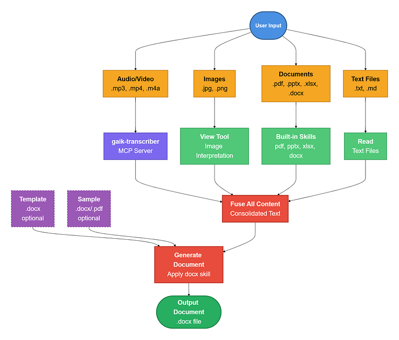

# Document Processing Skill

A Claude Code skill and MCP server for converting scattered meeting materials into structured Word documents.

Read the full article on the development of this skill at [Medium](https://medium.com/@umairali.khan/i-created-a-claude-skill-that-turns-piles-of-messy-documents-media-into-a-structured-report-19e9950f93b2).

## Overview

This project provides an automated pipeline for transforming various inputs (audio recordings, handwritten notes, diagrams, digital notes, and supplementary documents) into a single, well-formatted Microsoft Word deliverable.



## Project Structure

```
document-processing-skill/
├── documenting-meetings/          # Claude skill for meeting documentation
│   ├── SKILL.md                   # Main skill specification and workflow
│   ├── EVALUATION.md              # Test evaluation prompts and criteria
│   └── reference/
│       ├── INPUT_FORMATS.md       # Detailed input file handling guide
│       └── OUTPUT_SECTIONS.md     # Output section specification
├── transcription-MCP/             # MCP server for audio/video transcription
│   ├── server.py                  # FastMCP server implementation
│   └── .env                       # Environment configuration (requires setup)
└── sample_data/                   # Example data for testing
    ├── input_documents/           # Meeting materials (audio, images, docs, notes)
    ├── templates/                 # Blank template documents
    └── sample_documents/          # Sample output documents for formatting reference
```

## Components

### 1. Claude Skill: `documenting-meetings`

A Claude Code skill that orchestrates the entire meeting documentation workflow.

**Trigger Keywords:** `meeting notes`, `meeting summary`, `meeting minutes`, `meeting documentation`, `action items from meeting`

**Supported Input Formats:**

| Category | File Types |
|----------|-----------|
| Audio/Video | `.mp3`, `.m4a`, `.wav`, `.ogg`, `.flac`, `.mp4`, `.mov`, `.avi`, `.mkv`, `.webm` |
| Images | `.jpg`, `.png`, `.gif`, `.webp`, `.bmp`, `.tiff`, `.heic` |
| Digital Notes | `.txt`, `.md`, `.rtf`, `.html` |
| Supplementary | `.pdf`, `.pptx`, `.xlsx`, `.docx` |

**Workflow:**

1. Collect context (meeting title, output preferences, focus areas)
2. Validate input folder structure
3. Inventory input files
4. Transcribe audio/video recordings via MCP
5. Interpret images (handwritten notes, diagrams)
6. Read digital notes
7. Check for templates and sample documents
8. Generate Word deliverable
9. Save to input folder

**Default Output Structure:**

- Meeting Summary (date, attendees, duration)
- Executive Summary
- Decisions Made
- Action Items (table with owner, due date, priority)
- Open Questions
- Follow-up Message (email template)

Sections are omitted if no relevant information exists.

### 2. MCP Server: `transcription-MCP`

A FastMCP server providing audio/video transcription capabilities using the GAIK transcriber library and OpenAI API.

**Tool Exposed:**

```python
transcribe_audio(file_path: str, enhanced: bool = False) -> str
```

**Parameters:**
- `file_path` (required): Full path to audio/video file
- `enhanced` (optional): Return enhanced transcript if `True`

**Returns:** Raw transcription text preserving original flow and structure.

## Setup

### Prerequisites

- Python 3.8+
- OpenAI API key
- Claude Code with MCP support
- GAIK transcriber library

### MCP Server Configuration

1. Navigate to the transcription-MCP folder:
   ```bash
   cd transcription-MCP
   ```

2. Create/update the `.env` file with your OpenAI API key:
   ```env
   OPENAI_API_KEY=your_openai_api_key
   OPENAI_API_TYPE=openai
   ```

3. Install dependencies:
   ```bash
   pip install mcp python-dotenv gaik
   ```

4. Register the MCP server in your Claude Code configuration.

### Skill Installation

1. Copy the `documenting-meetings` folder to your Claude Code skills directory
2. Ensure the MCP server is registered as `gaik-transcriber`
3. Verify MCP filesystem access is configured

## Usage

### Basic Usage

Provide a folder containing meeting materials:

```
I have meeting materials in C:\Meetings\Q3-Roadmap. Please create meeting minutes.
```

### Folder Structure

```
<your-folder>/
├── input_documents/     # Required: all meeting materials
├── templates/           # Optional: blank template with structure
└── sample_documents/    # Optional: sample showing desired style/format
```

### With Template

Place a `.docx` template in the `templates/` subfolder to use custom formatting and structure.

### With Sample Document

Place a completed meeting minutes example in `sample_documents/` to guide the style, tone, and length of the output.

## Sample Data

The `sample_data/` folder contains example files for testing:

| File | Description |
|------|-------------|
| `input_documents/notes.txt` | Digital meeting notes |
| `input_documents/meeting_recording.mp3` | Audio recording |
| `input_documents/sketch.png` | Handwritten notes/diagram |
| `input_documents/roadmap-presentation.pptx` | PowerPoint slides |
| `input_documents/project-budget.xlsx` | Budget spreadsheet |
| `input_documents/deployment-freeze-policy.pdf` | Policy document |
| `templates/meeting-template.docx` | Blank template |
| `sample_documents/sample-meeting-minutes.docx` | Example output |

## Key Design Principles

- **Modular Architecture** - Separate MCP server for transcription enables independent scaling
- **Fault Tolerant** - Continues processing if individual file operations fail
- **No Fabrication** - Only uses information from provided inputs; marks missing info as "TBD"
- **Format Flexible** - Adapts output based on template/sample presence
- **Path Safe** - Handles both Windows and POSIX path formats

## Dependencies

### Skill Dependencies
- MCP filesystem server
- gaik-transcriber MCP server
- Docx skill (for Word document creation)
- PDF/PPTX/XLSX skills (optional, for supplementary documents)

### MCP Server Dependencies
- `mcp.server.fastmcp`
- `gaik.building_blocks.transcriber`
- `python-dotenv`
- OpenAI API

