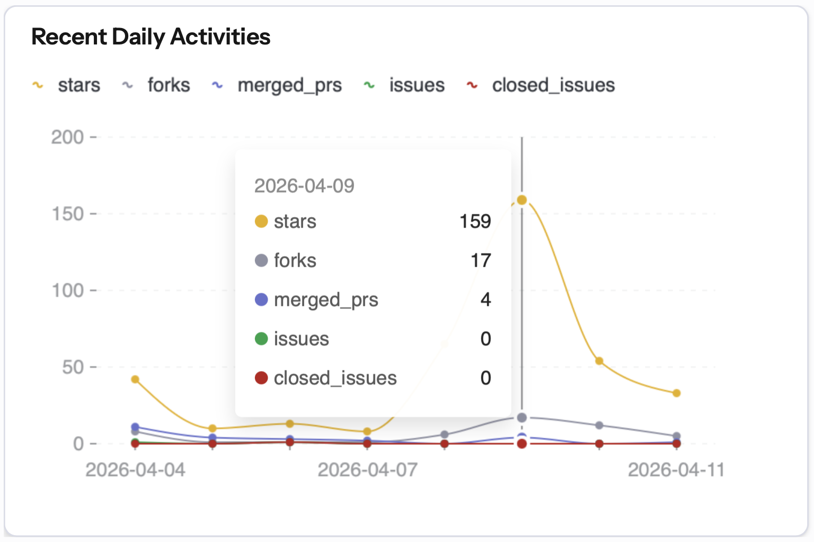

# Docs Index

This repository is documented around two active operating assumptions:

- vendor-backed historical data is local-first: mirror raw archive hours onto
  local disk, replay those raws directly, and keep shared infrastructure
  focused on raw mirroring and file serving
- public backtest runners are flat experiment specs built around `DATA`,
  `REPLAYS`, `STRATEGY_CONFIGS`, optional `EXECUTION` / `REPORT`, and a
  top-level `EXPERIMENT` manifest

PMXT is the first fully documented vendor path. Mirror and relay operations are
filed alongside the PMXT docs instead of being treated as a separate product
surface.

- [Setup](setup.md)
- [Backtests And Runners](backtests.md)
- [Research](research.md)
- [Execution Modeling](execution-modeling.md)
- [Data Vendors, Local Mirrors, And Raw PMXT](pmxt-byod.md)
- [Mirror And Relay Ops](pmxt-relay.md)
- [Vendor Fetch Sources And Timing](pmxt-fetch-sources.md)
- [Plotting](plotting.md)
- [Testing](testing.md)
- [Project Status](project-status.md)
- [License Notes](license.md)

### Acknowledgements

I'd like to thank everybody who I talked to along the way, as well as everybody who has starred, forked, filed issues, and asked questions about this project. Being only 19, I started with very little knowledge about the inner workings of markets on a microstructure level, and now have a lot more experience in strategy research and optimization. This repository started when I wanted to test my friend's hypotheses, and serves as my attempt at an all-in-one backtesting solution for prediction markets, with easy access to data and abstractions around a well-known backtesting framework. 

> 159 stars gained in a single day!