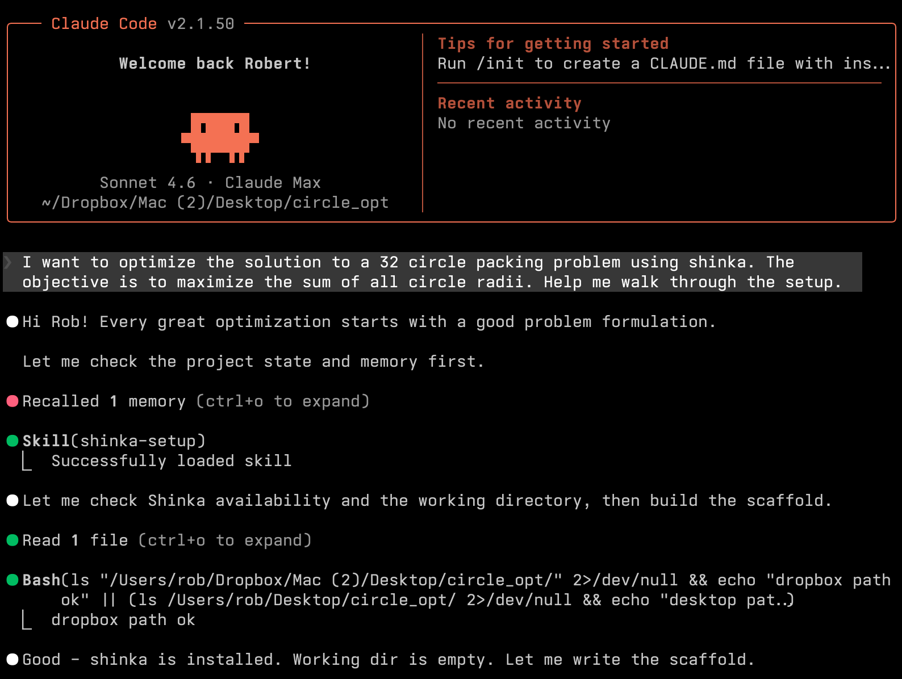
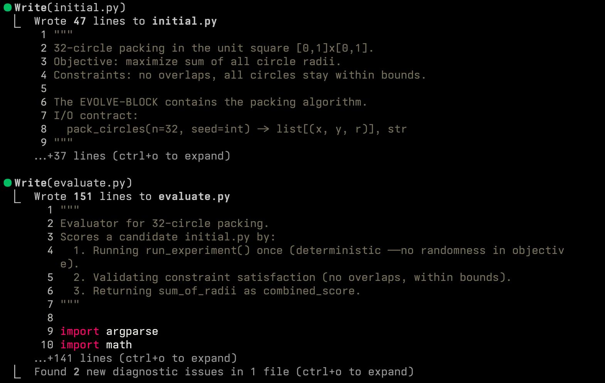
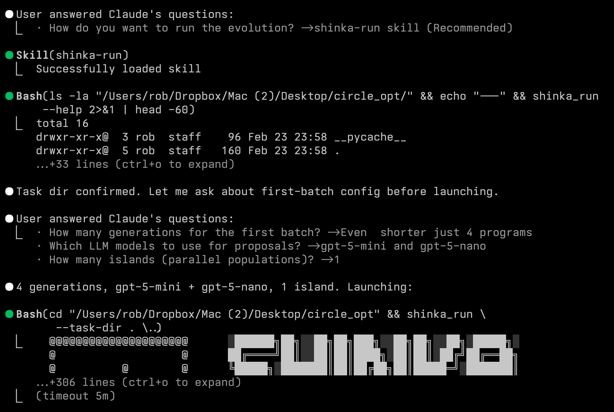
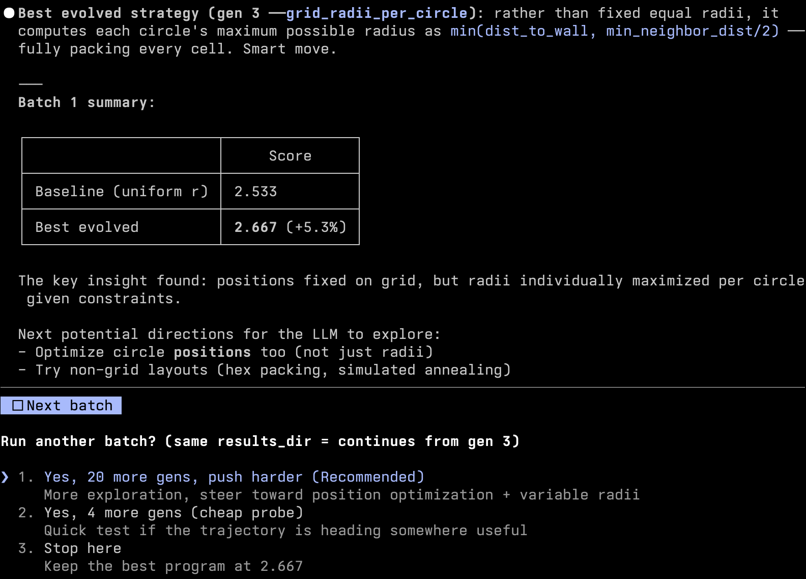

# Agentic Usage Guide

This guide shows how to run Shinka with coding agents using the project skills:

- `shinka-setup`: scaffold task files (`evaluate.py`, `initial.<ext>`, optional run config)
- `shinka-convert`: snapshot an existing repo into a Shinka task directory
- `shinka-run`: launch and iterate evolution batches via `shinka_run`
- `shinka-inspect`: load top-performing programs into a compact context bundle

It covers:
- installing Shinka
- installing Claude Code and/or Codex CLI
- installing the skills from this GitHub repo with `npx skills add`
- running a practical setup -> run -> inspect loop

## 1) Install Shinka

From a clean machine:

```bash
pip install shinka-evolve

# or
uv pip install shinka-evolve
```

Set API keys (example):

```bash
cp .env.example .env 2>/dev/null || true
# Edit .env and add OPENAI_API_KEY / ANTHROPIC_API_KEY as needed
```

## 2) Install Agent CLI(s)

Install one or both.

### Claude Code

```bash
npm install -g @anthropic-ai/claude-code
claude --version
```

### Codex CLI

```bash
npm install -g @openai/codex
codex --version
```

## 3) Install Skills from the Repo with `npx skills add`

The Shinka skills live directly in this repo under `skills/`. You do not need to copy files by hand or publish a separate npm package.

Install all current Shinka skills globally for Claude Code and Codex:

```bash
npx skills add SakanaAI/ShinkaEvolve --skill '*' -g -a claude-code -a codex -y
```

This installs from the GitHub repo source. The explicit `--skill '*'` makes "install all skills" unambiguous and avoids interactive prompts.

Installed skills currently include:

- `shinka-setup`
- `shinka-convert`
- `shinka-run`
- `shinka-inspect`

### Project-local install

Use this if you want the skills installed only for the current repo:

```bash
npx skills add SakanaAI/ShinkaEvolve --skill '*' -a claude-code -a codex -y
```

Typical project paths:

- Claude Code: `.claude/skills/`
- Codex: `.agents/skills/`

### Global install paths

For the global install command above, the relevant skill roots are:

- Claude Code: `~/.claude/skills/`
- Codex: `~/.codex/skills/`

### Install one skill only

For a narrower install:

```bash
npx skills add SakanaAI/ShinkaEvolve --skill shinka-setup -g -a claude-code -a codex -y
```

## 4) Setup Skill Walkthrough (`shinka-setup`)

Ask the agent to scaffold a new task directory and evaluator contract.

Example prompt:

```text
Use shinka-setup to scaffold a new task in examples/my_task.
Language: python.
Goal: maximize <metric>.
```

Illustration (setup flow):





Expected output:
- `initial.<ext>` with evolve block
- `evaluate.py` producing `metrics.json` + `correct.json`
- optional `run_evo.py` / `shinka.yaml` scaffolds when requested

## 5) Run Skill Walkthrough (`shinka-run`)

Use `shinka_run` for agent-driven evolution loops.

Minimal batch:

```bash
shinka_run \
  --task-dir examples/my_task \
  --results_dir results/my_task_agent \
  --num_generations 10
```

With core knobs via `--set`:

```bash
shinka_run \
  --task-dir examples/my_task \
  --results_dir results/my_task_agent \
  --num_generations 20 \
  --set evo.max_api_costs=0.5 \
  --set evo.llm_models='["gpt-5-mini","gemini-3-flash-preview"]' \
  --set db.num_islands=2 \
  --set db.parent_selection_strategy=weighted
```

Illustration (run flow):





## 6) Inspect Skill Walkthrough (`shinka-inspect`)

Use `shinka-inspect` after one or more batches to generate an agent-ready context file.

Minimal:

```bash
python skills/shinka-inspect/scripts/inspect_best_programs.py \
  --results-dir results/my_task_agent \
  --k 5
```

With filters and explicit output:

```bash
python skills/shinka-inspect/scripts/inspect_best_programs.py \
  --results-dir results/my_task_agent \
  --k 8 \
  --min-generation 10 \
  --max-code-chars 5000 \
  --out results/my_task_agent/inspect/top_programs.md
```

Output:
- default file: `results/my_task_agent/shinka_inspect_context.md`
- contains ranking + code snippets for top programs
- designed to be loaded directly into coding-agent context

## 7) Batch Iteration Rules (Important)

When using `shinka-run` skill:

- unless user explicitly requests fully autonomous execution, ask for config confirmation between batches
- keep `--results_dir` the same across continuation batches so prior state can reload
- change `--results_dir` only when intentionally forking a new run

## 8) Quick Validation Checklist

Before first run:

- `shinka_run --help` works
- task dir has `evaluate.py` + `initial.<ext>`
- API keys are available in environment
- `npx skills list` shows the installed Shinka skills
- for global installs, skills appear under `~/.claude/skills/` and/or `~/.codex/skills/`
- for project installs, skills appear under `.claude/skills/` and/or `.agents/skills/`

After each batch:

- check run artifacts/logs under the chosen `results_dir`
- review score and correctness trend
- run `shinka-inspect` and review the generated context markdown
- choose next batch config (budget, models, islands, attempts, generations)
